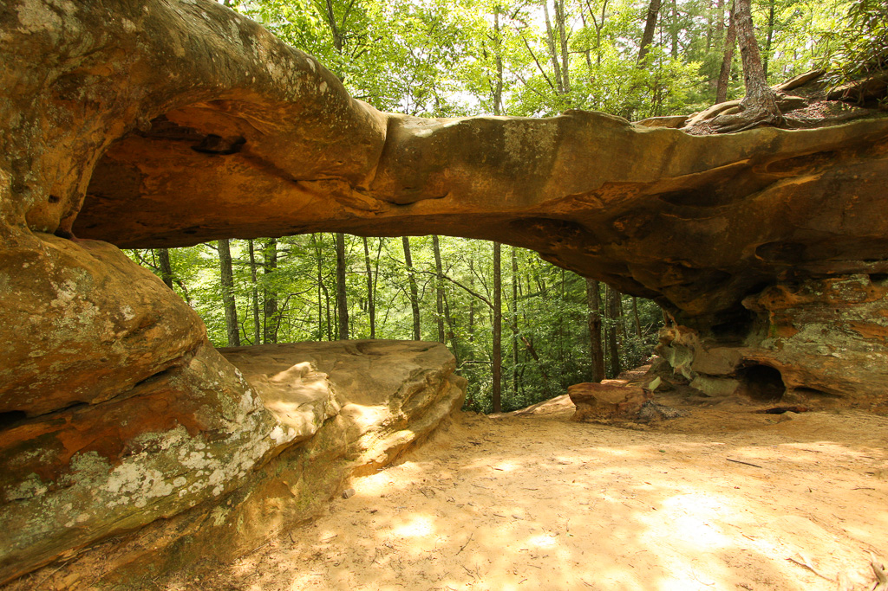
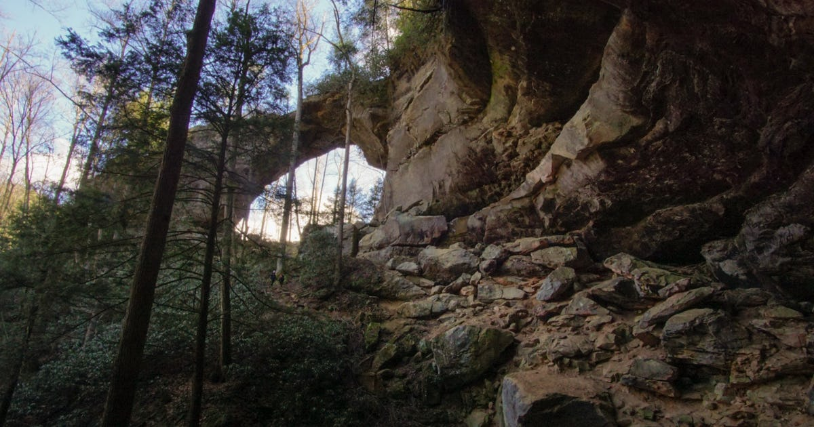
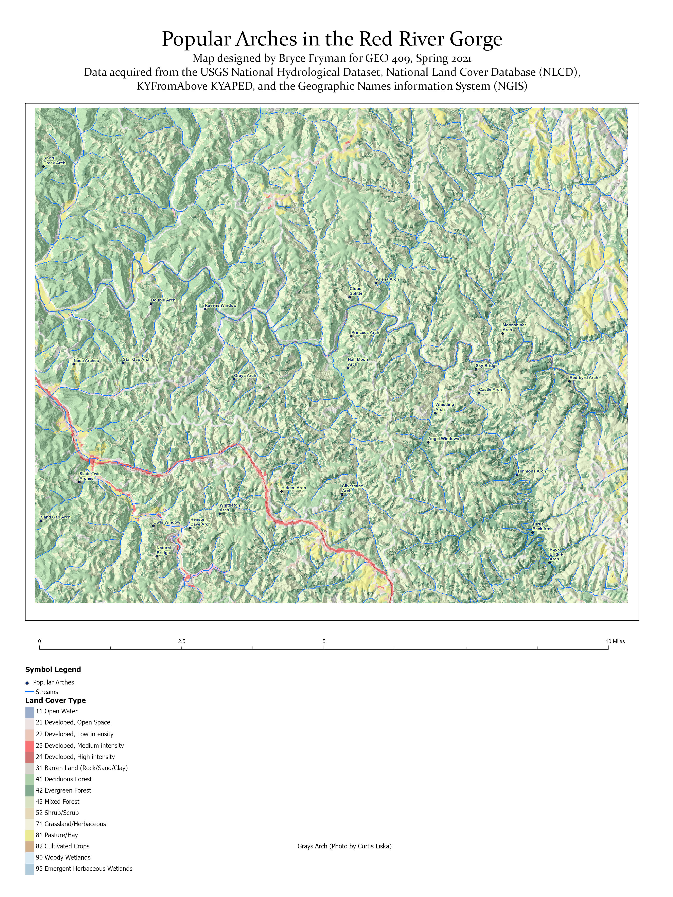
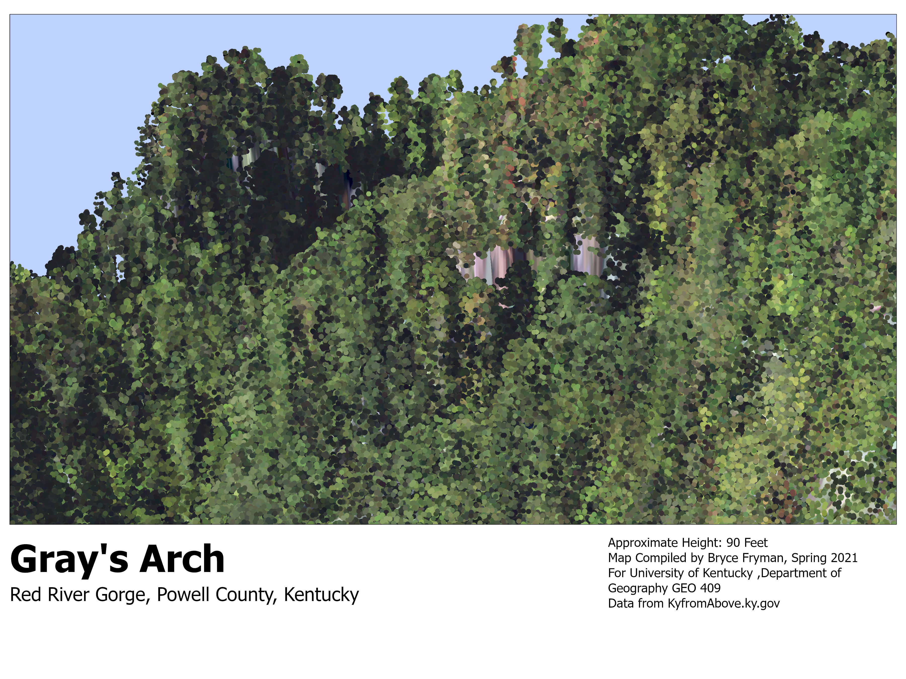

# rrg

Kentucky's Red River Gorge National Geological Area

## A Base map of arches

[Download a GeoPDF of arches](basemap/Layout1.pdf)

https://Bryce-Fryman.github.io/rrg/

## Photos of aoi features 
 Princess Arch (www.naturalbornhikers.com)
 Grays Arch (Curtis Liska)

## JPEG of map
 Red River Gorge Arches

## Birds eye view of Grays Arch

## Animation of Grays Arch

[Link to Video](https://youtu.be/DzCUPu62w5A)

## Interactive map of Grays Arch

[Link to potree point cloud render](potree) 